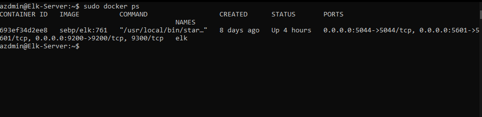

## Automated ELK Stack Deployment

The files in this repository were used to configure the network depicted below.

These files have been tested and used to generate a live ELK deployment on Azure. They can be used to either recreate the entire deployment pictured above. Alternatively, select portions of the ELK server Playbook file may be used to install only certain pieces of it, such as Filebeat.

  - [Webserver Playbook](Ansible/My-Playbook.yml)
  -	[ELK Sever Playbook](Ansible/ELKServer-Playbook.yml)
  -	[Filebeat Playbook](Ansible/roles/filebeat-playbook.yml)
  -	[Metricbeat Playbook](Ansible/roles/metricbeat-playbook.yml)

This document contains the following details:
- Description of the Topology
- Access Policies
- ELK Configuration
  - Beats in Use
  - Machines Being Monitored
- How to Use the Ansible Build

### Description of the Topology

The main purpose of this network is to expose a load-balanced and monitored instance of DVWA, the D*mn Vulnerable Web Application.

Load balancing ensures that the application will be highly available, in addition to restricting access to the network.

Integrating an ELK server allows users to easily monitor the vulnerable VMs for changes to the logs and system settings/metrics.

The configuration details of each machine may be found below.

| Name       	| Function       	| IP Address               	| Operating System      	|
|------------	|----------------	|--------------------------	|-----------------------	|
| Jump Box   	| Gateway        	| 10.0.0.10 138.91.251.180 	| Linux - Ubuntu Server 	|
| Red-1      	| DVWA Webserver 	| 10.0.0.7                 	| Linux - Ubuntu Server 	|
| Red-2      	| DVWA Webserver 	| 10.0.0.8                 	| Linux - Ubuntu Server 	|
| ELK-Server 	| ELK Stack      	| 10.1.0.4 20.98.70.215    	| Linux - Ubuntu Server 	|

### Access Policies

The machines on the internal network are not exposed to the public Internet. 

Only the ELK-Stack (Kibana application) and Jump-Box machine can accept connections from the Internet. Access to this machine is only allowed from the following IP addresses:
- Public IP address of local workstation

Machines within the network can only be accessed by the Jump-Box Machine at 10.0.0.10.

A summary of the access policies in place can be found in the table below.

| Name       	| Publicly Accessible 	| Allowed IP Addresses                          	|
|------------	|---------------------	|-----------------------------------------------	|
| Jump-Box   	| Yes                 	| Local Workstation Public IP 10.0.0.8 10.0.0.7 	|
| Red-1      	| No                  	| 10.0.0.10                                     	|
| Red-2      	| No                  	| 10.0.0.10                                     	|
| ELK-Server 	| Yes                 	| Local Workstation Public IP 10.0.0.10         	|

### Elk Configuration

Ansible was used to automate configuration of the ELK machine. No configuration was performed manually, which is advantageous because as new settings and programs
can be rapidly and consistently be deployed.

The playbook implements the following tasks:
- Installs docker, python 3 PIP
- Increases virtual memory
- Install docker python package
- Download and lauch docker elk container
- Enable systemd docker service
- Run ELK docker container

The following screenshot displays the result of running `docker ps` after successfully configuring the ELK instance.

### Target Machines & Beats
This ELK server is configured to monitor the following machines:
- Red1: 10.0.0.7
- Red2: 10.0.0.8

We have installed the following Beats on these machines:
- Filebeat
- Metricbeat

These Beats allow us to collect the following information from each machine:
- Filebeat collects system logs from the webserver VMs and sends it to the ELK server and there it is compiled in a user friednly manner by the Kibana application
- Metricbeat sends system stats about the web VMs to the ELK server as well for compliling in human readable formats

### Using the Playbook
In order to use the playbook, you will need to have an Ansible control node already configured. Assuming you have such a control node provisioned: 

SSH into the control node and follow the steps below:
- Copy the ELK-Playbook.yml file to /etc/ansible.
- Update the hosts file to include the ELK-Server
- Run the playbook, and navigate to http://(Public IP of Elk Server):5601/app/kibana to check that the installation worked as expected.
